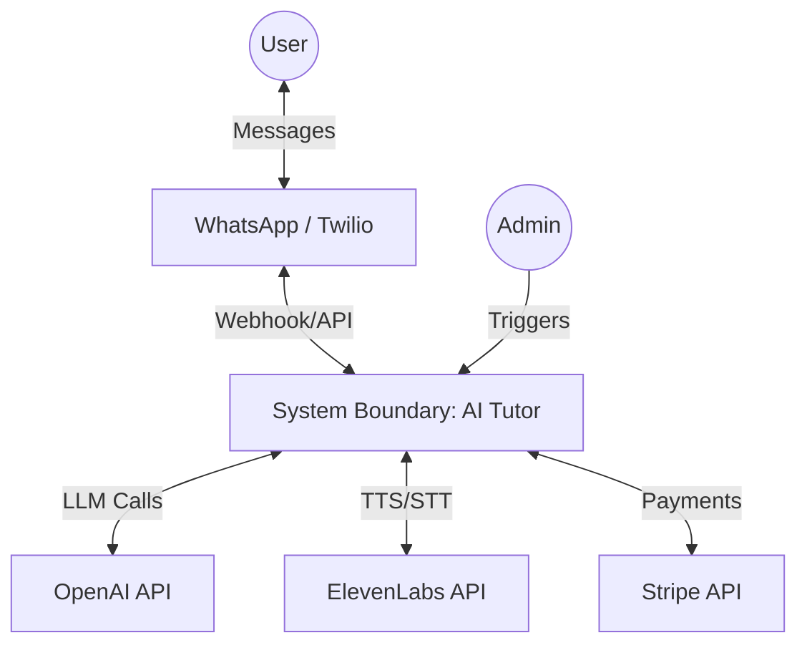
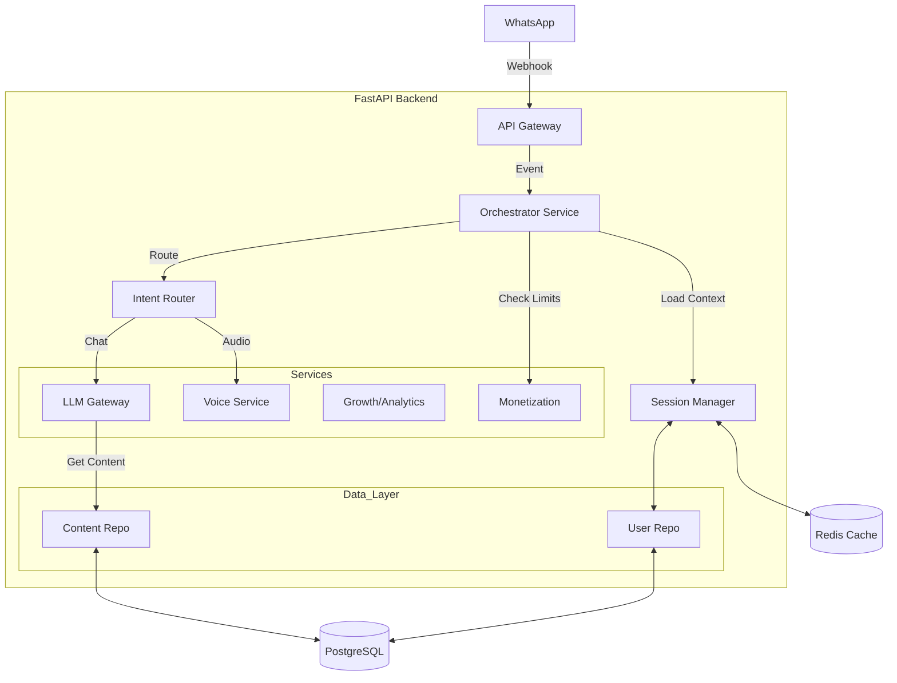
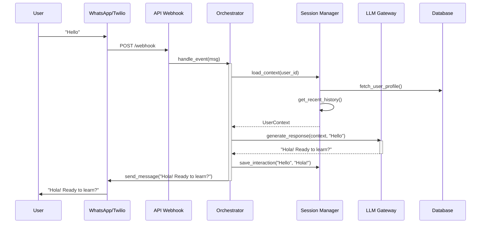
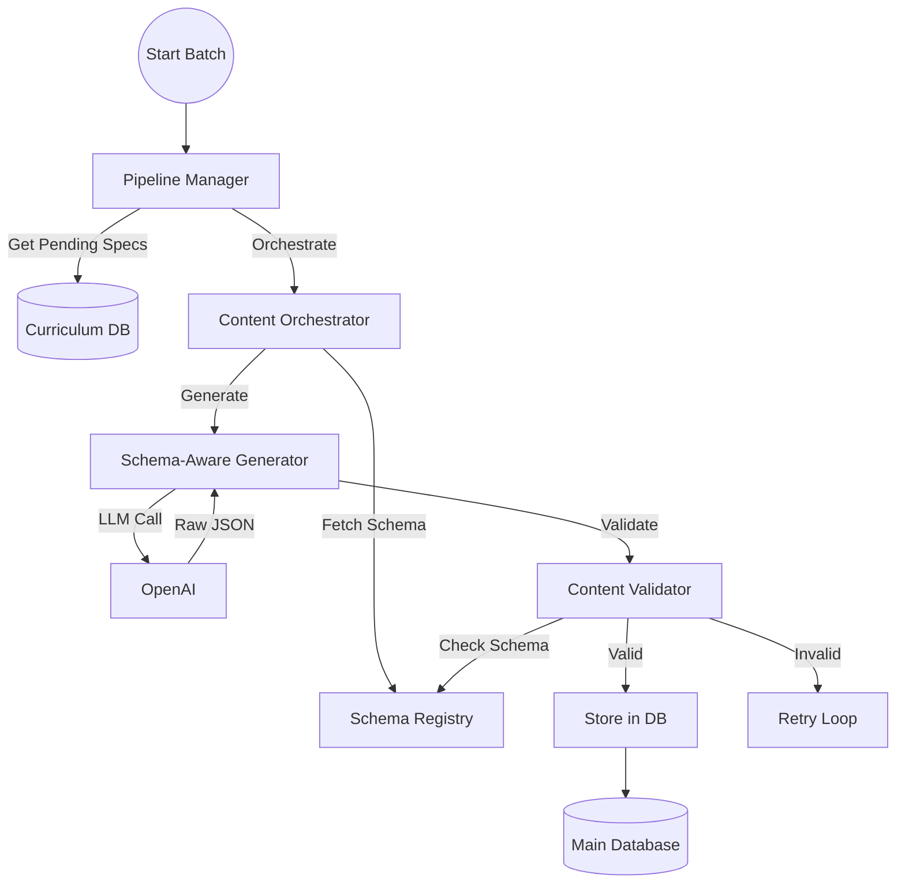
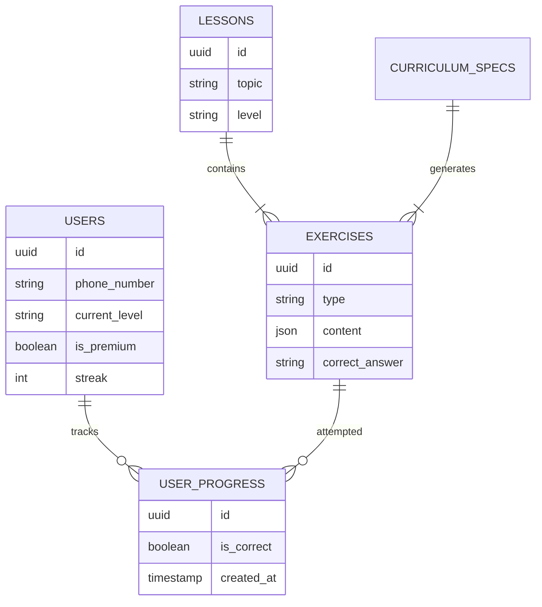

# 🏗️ Architecture Diagrams

This document contains visual representations of the **WhatsApp-First AI Language Tutor** system architecture, user flows, and data models using Mermaid.js.

## 1. System Context (High-Level)

This diagram shows how the system interacts with external world and services.

## 2. Container Architecture

This diagram details the internal components of the backend.

## 3. Interaction Flow: Basic Chat

The lifecycle of a user message processing.

## 4. Content Generation Pipeline (Async)

How the curriculum is generated in the background.

## 5. Data Model (ERD)

Key entities in the database.

